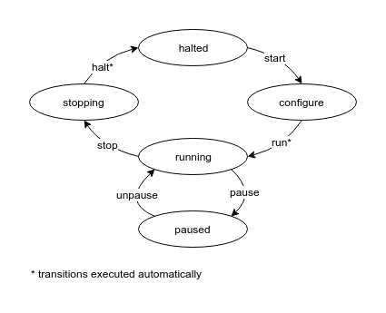

# Application

Inherit class `comet.Application` to implement your custom control and measurement application.

## State machine



## State hooks

Implement following methods of class `comet.Application` to execute code on a certain application state.

* `on_halted` (initial state)
* `on_configure`
* `on_running`
* `on_stopping`
* `on_paused`

## Example

```python
import comet

class MyApplication(comet.Application):

    def __init__(self):
        super(MyApplication, self).__init__("My App")
        # Create parameters
        self.add_param('loops', type=int, min=0, max=8, label="# of loops")
        self.add_param('delay', default=1.0, min=0.0, max=16.0, prec=2, unit='s')
        # Create VISA devices
        self.add_device('multi', 'ASRL1::INSTR')
        # Create data collections
        self.add_collection('iv', IVCollection)
        # Create procedures
        self.add_procedure('measure', MeasureProcedure)

    def on_configure(self):
        # Reset a device
        device = self.app.devices.get('multi')
        device.write('*RST')

    def on_running(self):
        # Run a procedure
        measure = self.procedures.get('measure')
        measure.run()

class IVCollection(comet.Collection):

    def configure(self):
        # Create metrics
        self.add_metric('time', unit='s')
        self.add_metric('i', unit='A')
        self.add_metric('v', unit='V')

class MeasureProcedure(comet.Procedure):

    def run(self):
        # Get parameters
        loops = self.app.params.get('loops')
        delay = self.app.params.get('delay')
        # Get device
        device = self.app.devices.get('multi')
        # Get collection
        coll = self.app.collections.get('iv')
        # Run measurement loop
        for step in range(loops):
            # Read current
            device.write('MODE:CURR')
            i = device.query('READ?'))
            # Read volts
            device.write('MODE:VOLT')
            v = device.query('READ?'))
            # Append record to collection
            coll.append(time=time.time(), i=i, v=v)
            # Delay next iteration
            time.sleep(delay)

# Create user application
app = MyApplication()

# Serve application on http://localhost:8080
server = comet.HttpServer(app)
server.run()
```
